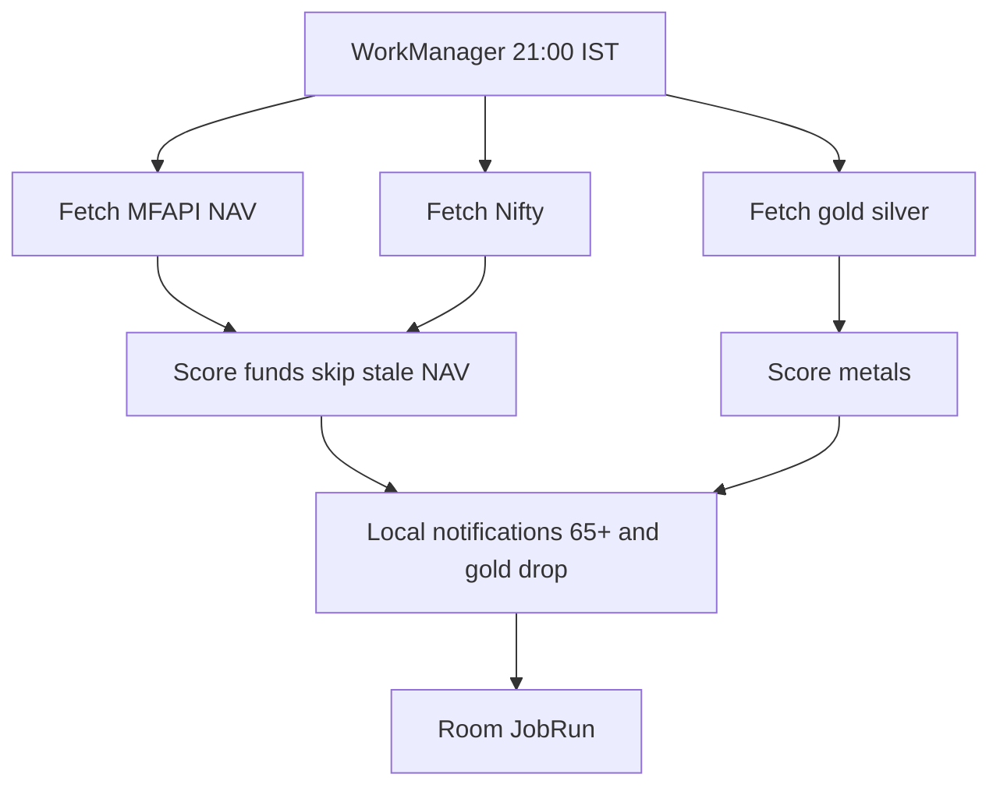

# 11 — Daily background jobs (“cron”)

This **is** the scheduler. There is no Linux cron and no gym `artisan market:run`. Android **WorkManager** runs the same pipeline every day.

## Workers

| Worker | When | Constraints |
|---|---|---|
| `DailyPipelineWorker` | Periodic 24h, flex 2h, targeting **21:00 Asia/Kolkata** | `NetworkType.CONNECTED`, not low storage |
| `RetryMorningWorker` | 07:00 IST **only if** yesterday’s fund NAV was missing/stale | Network |
| `BackfillWorker` | Once after first launch (and “Reload history” in Account) | Network; run as **foreground service** |
| `ManualRefreshWorker` | Pull-to-refresh / “Run update now” | Network |

Do not use a forever-running service. Do not depend on the user opening the app.

## DailyPipelineWorker steps (order)

1. Fetch latest NAV for each catalog fund; upsert `FundPrice`; update `lastNav` / growth.
2. Fetch latest Nifty point(s); upsert `BenchmarkPrice`.
3. Fetch gold + silver; upsert prices.
4. For each fund: if latest NAV **equals** prior session NAV → **do not score**. Else compute dip score and upsert `InvestmentSignal` for that `signal_date`.
5. Same for metals.
6. Evaluate notify rules ([08-notifications.md](08-notifications.md)); post notifications; write `NotificationLog`.
7. Write `JobRun` success/fail.

If step 1 gets **no new date** vs last stored NAV date, still try metals, then enqueue morning retry for funds.

## First-run BackfillWorker

Needed so Missed opportunities is not empty.

1. Foreground notification: “Mizan is loading history (this can take a few minutes).”
2. Per fund: MFAPI full history (cap ~5 years).
3. Nifty history (~5 years).
4. Metal history (~5 years).
5. Walk dates and **backfill scores** with the same skip-unchanged-NAV rule (can be heavy — batch + yield).
6. Do **not** fire 5 years of notifications. Only notify from **today’s** (or last session’s) score after backfill completes.
7. Schedule `DailyPipelineWorker`.

## Time zone

All job windows and `price_date` / `signal_date` are **Asia/Kolkata**. MFAPI dates are already Indian session dates.

## OS reality (must handle)

- Doze / OEM battery killers (Xiaomi, Vivo, Samsung): document “Allow background / Autostart” in Account → Help.
- `SCHEDULE_EXACT_ALARM` / `USE_EXACT_ALARM`: prefer inexact daily + morning retry over fighting OEM.
- WorkManager is **not** second-accurate. “Daily after NAV publish” is the requirement, not 21:00:00.000.
- If the phone is off at 21:00, run at next chance (`ExistingPeriodicWorkPolicy.KEEP` + expedited retry when online).

## Observability in-app

Account → Last job: time, duration, funds updated, signals written, notifies posted, last error. Button: **Run update now**.

## Parity with the old web pipeline (logic only)

Web `market:run` was: fetch fund growth → fetch metal prices → calculate signals → calculate metal signals → send notifications.

Mizan does the same **on device**, then **Android notify** instead of email.
